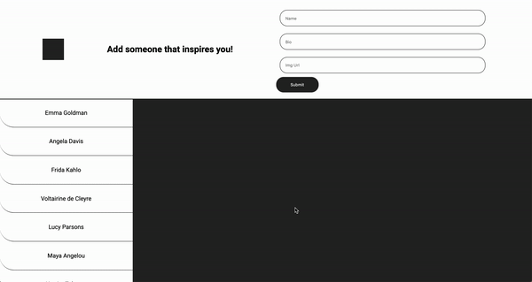

# Lab

## The styling for the app the provided for you, please keep the structure intact for it to work.

## Components:

Your app should render FOUR components:

1. App
2. Topbar
3. Sidebar
4. ShowPanel

## API

Clone the API from this repo: https://github.com/mazenswar/BACKEND-React-State-Props-and-Data-Flow

After cloning it down, run `rails db:create && rails db:migrate && rails db:seed`

The backend has one model "Person" with the following attributes:

1. Id
2. name
3. img_url
4. bio

The main end point that you will use to fetch is ('http://localhost:3000/people')

## Deliverables

1. Identify the structure of the app and decide which component(s) will hold your data.
2. When your app loads, you should fetch data and store it in the application.
3. `<Topbar />` should have a form for creating a new "person". Creating a new person should persist on the backend and dynamically render that person's information in the `<ShowPanel />` and that person's name in `<Topbar />`.
4. `<Topbar />` should receive a prop which is the name of the person selected from `<Sidebar />` and render it.
5. `<Sidebar />` will render a list of people's names.
6. When a user clickes on a name in `<Sidebar />`, the `<ShowPanel />` should render that person's information.
7. `<ShowPanel />` should receive a prop of a person's info based on what the user clicks in the `<Sidepanel />` and render that info.
8. `<ShowPanel />` has a delete button that should delete that person from the backend, the `<ShowPanel />`, and `<Sidebar />`.

9. (OPTIONAL): Some people have bios that are longer than one paragraph. These people will have the word 'BREAK' in their bios between paragraphs. Think about how you could render each of those paragraphs in its own `
` tag without displaying the word "BREAK".

At the end, your app should look something like this:

